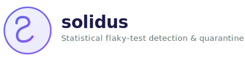

<p align="center">
  
</p>

<p align="center">
  <em>Statistical flaky-test detection & quarantine. Trust your CI again.</em>
</p>

<p align="center">
  <a href="LICENSE"></a>
  <a href="package.json"></a>
  <a href="https://github.com/sujal-b/Solidus/actions/workflows/test.yml"></a>
  <a href="https://www.npmjs.com/package/solidus-cli"></a>
</p>

<br/>

**solidus** tracks test results across runs, automatically detects flakiness using statistical pass-rate analysis, and surfaces findings in CI — so you know *which* tests are unreliable and *when* they became that way.

> Flaky tests erode CI trust, waste developer time, and let real bugs slip through. Retrying hides flakiness. solidus **surfaces** it.

---

## Features

- **Statistical detection** — Pass-rate analysis over N runs, not guesswork. Configurable thresholds, sliding windows, no magic.
- **CI-native** — GitHub Actions annotations, step summaries, and composite action for zero-config CI integration.
- **Framework plugins** — Drop-in reporters for Jest, Vitest, Mocha, and Playwright. Install once, collect history automatically.
- **Auto-quarantine** — Automatically exclude flaky tests from CI gates. Stop the noise without losing data.
- **Trend analysis** — See flakiness evolve over time. Spot regressions before they become problems.
- **Git bisect integration** — Pinpoint the exact commit where a test became flaky.
- **JUnit XML support** — Works with pytest, Go test, Rust test, and any framework that emits JUnit XML.
- **Slack notifications** — Get flake reports delivered to your team channel after every run.
- **Cross-platform** — Windows, macOS, Linux. Pure JavaScript, zero native dependencies.
- **Crash-safe** — Atomic file writes and file locks for parallel CI runners.
- **Privacy-first** — Zero telemetry, zero network calls, zero servers. Your test data never leaves your machine.

<br/>

## Quick start

```bash
# Install globally (or use via npx)
npm install -g solidus-cli

# Initialize the .solidus/ directory
solidus init

# Run your tests and export results as JSON
npm test -- --json --outputFile=results.json

# Analyze for flakiness
solidus analyze -i results.json
```

```text
solidus flake report
  14 stable  2 flaky  0 broken
  Total: 16 tests across all runs

  Tests needing attention:
    ⚠️ Dashboard loads data (6/10 passed)
    ⚠️ Payment processes charge (7/10 passed)
```

**That's it.** No database, no daemon, no cloud. solidus stores run history as local JSON files and computes statistics on demand.

<br/>

## How it works

solidus takes a simple, file-based approach to flake detection:

```
  ┌────────────┐     ┌──────────────┐     ┌──────────────────────┐
  │ Test runs  │────▶│ HistoryStore │────▶│    FlakeDetector     │
  │ (JSON/JUnit)│    │ (JSON files) │     │ (pass-rate analysis) │
  └────────────┘     │  crash-safe  │     └──────────┬───────────┘
                     └──────────────┘                │
                                                     ▼
                                           ┌──────────────────────┐
                                           │  CLI / CI / Slack    │
                                           │  Report / Trend /    │
                                           │  Bisect / Quarantine │
                                           └──────────────────────┘
```

Each test run is saved as a JSON file in `.solidus/history/`. When you run `analyze`, solidus reads the last N runs, computes per-test pass rates, and classifies every test. Everything is stateless — detection is deterministic given the same history.

<br/>

## CLI Reference

### `solidus analyze`

Analyze test results for flakiness.

| Option | Default | Description |
|--------|---------|-------------|
| `-i, --input <file>` | stdin | Input file (JSON or JUnit XML) |
| `--input-format <format>` | `json` | Input format: `json` or `junit` |
| `--db-path <path>` | `.solidus/history.db` | History storage path |
| `--window <n>` | `10` | Number of recent runs to consider |
| `--min-runs <n>` | `3` | Minimum runs before classification |
| `--auto-quarantine` | `false` | Auto-quarantine flaky tests |
| `--no-auto-quarantine` | — | Disable auto-quarantine |
| `--log-level <level>` | `info` | `silent` \| `error` \| `warn` \| `info` \| `debug` |
| `--json` | — | Machine-readable JSON output |
| `--github` | — | GitHub Actions annotations |
| `--fail-on-flaky` | — | Exit 1 if flaky tests found |

### `solidus report`

Show the latest flake report.

| Option | Default | Description |
|--------|---------|-------------|
| `--db-path <path>` | `.solidus/history.db` | History storage path |
| `--json` | — | Machine-readable JSON output |

### `solidus trend`

Show flakiness trend over time — visualizes how flake counts evolve across runs.

| Option | Default | Description |
|--------|---------|-------------|
| `--db-path <path>` | `.solidus/history.db` | History storage path |
| `--window <n>` | `10` | Window size for analysis |
| `--min-runs <n>` | `3` | Minimum runs before classification |
| `--json` | — | Machine-readable JSON output |

### `solidus bisect <test-name>`

Find when a test became flaky by cross-referencing commit SHAs in history.

| Option | Default | Description |
|--------|---------|-------------|
| `--file <file>` | — | Source file to narrow the search |
| `--db-path <path>` | `.solidus/history.db` | History storage path |
| `--json` | — | Machine-readable JSON output |

### `solidus quarantine`

Manage quarantined flaky tests.

| Subcommand | Description |
|------------|-------------|
| `list` | List all quarantined tests |
| `add <file> <name>` | Add a test to quarantine |
| `remove <file> <name>` | Remove a test from quarantine |
| `generate-ignore --format <jest\|vitest>` | Generate config snippets to skip quarantined tests |
| `clear` | Remove all quarantined tests |

### `solidus status`

Show history statistics (run count, latest run).

| Option | Default | Description |
|--------|---------|-------------|
| `--db-path <path>` | `.solidus/history.db` | History storage path |

### `solidus init`

Initialize the `.solidus/` directory and update `.gitignore`.

### `solidus clear`

Delete all stored run history.

<br/>

## Input Formats

### JSON (default)

Pipe your test runner's JSON output or point to a file:

```json
{
  "id": "run_abc123",
  "timestamp": "2026-06-30T12:00:00Z",
  "commit": "abc123def",
  "branch": "main",
  "ciRunId": "ci-12345",
  "results": [
    {
      "name": "Login renders form",
      "file": "src/Login.test.tsx",
      "status": "pass",
      "durationMs": 12
    },
    {
      "name": "Dashboard loads data",
      "file": "src/Dashboard.test.tsx",
      "status": "fail",
      "durationMs": 156,
      "error": "TimeoutError: request timed out"
    }
  ]
}
```

### JUnit XML

solidus can parse JUnit XML reports from any framework:

```bash
# pytest
solidus analyze -i pytest-results.xml --input-format junit

# Go test
go test -v -json ./... 2>&1 | solidus analyze --input-format junit

# Any JUnit output
solidus analyze -i test-results.xml --input-format junit
```

Supports `<testsuites>` / `<testsuite>` / `<testcase>` elements, `<failure>`, `<error>`, `<skipped>` child elements, and namespace-prefixed tags from Java/Jakarta tooling.

<br/>

## Classification

solidus classifies each test by its pass rate over the analysis window:

| Label | Condition | Pass Rate | Meaning |
|-------|-----------|:---------:|---------|
| ✅ **stable_pass** | `passRate >= thresholdHigh` | ≥ 95% | Healthy |
| ❌ **stable_fail** | `passRate <= thresholdLow` | ≤ 5% | Consistently broken — needs a fix |
| ⚠️ **flaky** | Between thresholds | 5–95% | Unreliable — needs investigation |
| 📊 **insufficient_data** | `< minRuns` runs | — | Not enough history yet |

*Thresholds are configurable (see Configuration below).*

<br/>

## Configuration

solidus loads configuration from four sources (higher priority wins):

```
CLI flags       (highest priority)
  ↑
Environment vars
  ↑
Config file      (.solidusrc)
  ↑
Defaults         (sensible built-in values)
```

### Environment variables

| Variable | Maps to | Default |
|----------|---------|---------|
| `SOLIDUS_FLAKY_LOW` | `flakyThresholdLow` | `0.05` |
| `SOLIDUS_FLAKY_HIGH` | `flakyThresholdHigh` | `0.95` |
| `SOLIDUS_WINDOW` | `windowSize` | `10` |
| `SOLIDUS_MIN_RUNS` | `minRuns` | `3` |
| `SOLIDUS_DB_PATH` | `dbPath` | `.solidus/history.db` |
| `SOLIDUS_AUTO_QUARANTINE` | `autoQuarantine` | `false` |
| `SOLIDUS_LOG_LEVEL` | `logLevel` | `info` |
| `SOLIDUS_SLACK_WEBHOOK` | Slack webhook URL | *(not set)* |

### Config file (`.solidusrc`)

```json
{
  "windowSize": 20,
  "minRuns": 5,
  "flakyThresholdLow": 0.1,
  "flakyThresholdHigh": 0.9,
  "autoQuarantine": true,
  "logLevel": "info"
}
```

<br/>

## CI Integration

### GitHub Actions (composite action)

```yaml
- run: npm test -- --json --outputFile=test-results.json
- uses: solidus/solidus/.github/actions/solidus@v1
  with:
    results-file: test-results.json
    fail-on-flaky: true
```

**Inputs:**

| Input | Default | Description |
|-------|---------|-------------|
| `results-file` | `test-results.json` | Path to test results JSON |
| `db-path` | `.solidus/history.db` | History DB path |
| `window` | `10` | Number of recent runs |
| `min-runs` | `3` | Min runs before classification |
| `fail-on-flaky` | `false` | Exit with error if flaky found |
| `auto-quarantine` | `false` | Auto-quarantine flaky tests |

**Outputs:** `flaky-count`, `stable-count`, `broken-count`, `quarantined-count`, `report`

### Direct CLI

```yaml
- run: npm test -- --json --outputFile=results.json
- run: npx solidus-cli analyze -i results.json --github
  env:
    SOLIDUS_WINDOW: 15
    SOLIDUS_SLACK_WEBHOOK: ${{ secrets.SLACK_WEBHOOK }}
```

Both methods produce:
- Warning annotations on flaky test source files (`::warning file=...`)
- Error annotations on consistently-failing tests (`::error file=...`)
- Step summary with flake report table (`GITHUB_STEP_SUMMARY`)
- Step outputs for downstream jobs (matrix decisions, gate checks)

### Slack notifications

Set the `SOLIDUS_SLACK_WEBHOOK` environment variable and solidus will automatically deliver a formatted flake report to your channel after every `analyze` run:

```
🤖 solidus flake report
  Total: 156 · Stable: 148 ✅ · Flaky: 6 ⚠️ · Broken: 2 ❌
```

<br/>

## Framework Plugins

solidus ships with native reporters for popular test frameworks. When installed, they auto-collect results into history on every test run and print a flake summary.

### Jest

```js
// jest.config.mjs
export default {
  reporters: [
    "default",
    ["solidus/dist/plugins/jest.js", { dbPath: ".solidus/history.db" }],
  ],
};
```

### Vitest

```ts
// vitest.config.ts
import SolidusReporter from "solidus/dist/plugins/vitest.js";

export default {
  reporters: [
    "default",
    new SolidusReporter({ dbPath: ".solidus/history.db" }),
  ],
};
```

### Mocha

```bash
mocha --reporter solidus/dist/plugins/mocha.js \
      --reporter-options dbPath=.solidus/history.db
```

### Playwright

```ts
// playwright.config.ts
export default {
  reporter: [
    ["html"],
    ["solidus/dist/plugins/playwright.js", { dbPath: ".solidus/history.db" }],
  ],
};
```

<br/>

## Use Cases

### Find flaky tests *before* your team does

```bash
solidus trend
```

```text
solidus trend report
  Runs: 47 · Data points: 20
  Period: 2026-03-01 → 2026-06-30
  Current flaky: 3 · Max: 7 📈 increasing

  Flaky tests over time:
  03-01  3 ████████
  04-01  5 ██████████████
  05-01  7 ████████████████████
  06-01  4 ███████████
  06-30  3 ████████

  ⚠️ Flakiness is increasing
  Consider reviewing recently merged code or enabling auto-quarantine.
```

### Pinpoint the commit that introduced flakiness

```bash
solidus bisect "Dashboard loads data"
```

```text
solidus bisect
  Test: Dashboard loads data
  File: src/Dashboard.test.tsx
  History: 6/10 passed (60%)
  Confidence: 100%

  🔍 Transition found:
     Last known good commit: a1b2c3d4
     First known bad commit: e5f6g7h8

  Suggested git bisect:
    git bisect start --first-parent
    git bisect good a1b2c3d4
    git bisect bad e5f6g7h8
```

### Auto-quarantine flaky tests

```bash
solidus analyze -i results.json --auto-quarantine
```

Quarantined tests are tracked and excluded from CI gates. Use `solidus quarantine list` to see all entries and `solidus quarantine generate-ignore --format jest` to get config snippets that skip quarantined tests in your framework.

<br/>

## Comparison

| Feature | solidus | Rerun-flaky | Manual tracking |
|---------|:-------:|:-----------:|:---------------:|
| Statistical detection | ✅ | ❌ | ❌ |
| Pass-rate history | ✅ | ❌ | ❌ |
| CI annotations | ✅ | ⚠️ partial | ❌ |
| Trend analysis | ✅ | ❌ | ❌ |
| Flaky bisect | ✅ | ❌ | ❌ |
| Auto-quarantine | ✅ | ❌ | ❌ |
| Framework plugins | ✅ | ❌ | ❌ |
| JUnit XML support | ✅ | ❌ | ❌ |
| Slack notifications | ✅ | ❌ | ❌ |
| Zero external deps | ✅ | ✅ | ✅ |
| No telemetry | ✅ | ✅ | ✅ |

<br/>

## Security

- **Zero telemetry, zero network calls** — solidus never phones home. No analytics, no tracking, no servers.
- **Input sanitization** — Test names are sanitized before appearing in CI annotations (`<>"'&` removed).
- **No dynamic imports** — `require()`/`import()` never called with user-controlled paths.
- **Atomic file writes** — History files are written to temp then renamed (crash-safe).
- **File locks via `O_EXCL`** — Concurrent CI runners on the same machine coordinate with exclusive-create file locks.

See [SECURITY.md](SECURITY.md) for the full security policy and vulnerability reporting process.

<br/>

## Contributing

Contributions are welcome! See [CONTRIBUTING.md](CONTRIBUTING.md) for:

- Development setup and build instructions
- Project structure overview
- Test conventions
- Pull request guidelines
- Release process

<br/>

## Why not just retry?

Retry hides flakiness. solidus **surfaces** it.

Teams that retry flaky tests instead of fixing them see flakiness multiply — once a test is known to be unreliable but ignored, more appear. solidus gives you visibility, data, and a path to zero flaky tests.

> *"You cannot fix what you do not measure."*

<br/>

## License

[MIT](LICENSE) © solidus
